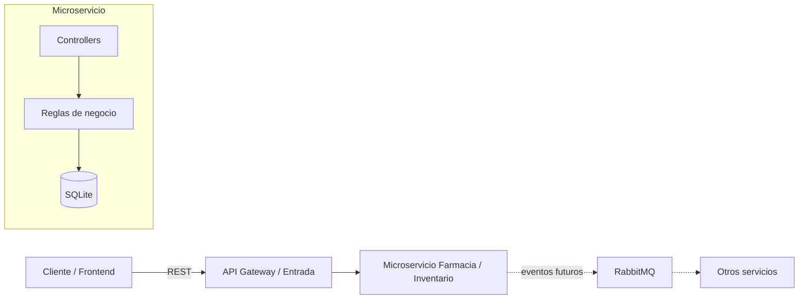

# Microservicio Farmacia / Inventario

Microservicio independiente para controlar el stock de medicamentos e insumos hospitalarios dentro de la arquitectura de microservicios de HotelSync.

## Alcance

Este servicio implementa el dominio asignado en la actividad:

- Crear medicamentos.
- Consultar medicamentos.
- Aumentar stock.
- Disminuir stock con control de concurrencia.
- Consultar medicamentos próximos a vencer.
- Consultar medicamentos con stock bajo.
- Persistencia propia en SQLite.
- Validaciones de entrada y manejo explícito de errores HTTP.

La ficha de HotelSync propone NestJS sobre Node.js para servicios transaccionales. Por una contingencia operativa, el servicio migró su persistencia de PostgreSQL a SQLite (archivo local, sin servidor de base de datos separado).

## Endpoints

Base local: `http://localhost:3001/api`

| Método | Endpoint | Descripción |
|---|---|---|
| POST | `/medicamentos` | Registra un medicamento/lote |
| GET | `/medicamentos` | Lista medicamentos |
| PATCH | `/medicamentos/:id/aumentar` | Aumenta stock |
| PATCH | `/medicamentos/:id/disminuir` | Disminuye stock de forma segura |
| GET | `/medicamentos/proximos-vencer` | Lista lotes que vencen en los próximos 30 días |
| GET | `/medicamentos/bajo-stock` | Lista medicamentos en o por debajo del umbral |

### POST /medicamentos

```json
{
  "nombreMedicamento": "Paracetamol",
  "presentacion": "Tableta 500 mg",
  "lote": "PAR-2026-001",
  "fechaVencimiento": "2027-05-30T00:00:00.000Z",
  "cantidadDisponible": 100,
  "umbralMinimo": 20
}
```

Respuesta: `201 Created`.

### PATCH /medicamentos/1/aumentar

```json
{
  "cantidad": 50
}
```

Respuesta: `200 OK`.

### PATCH /medicamentos/1/disminuir

```json
{
  "cantidad": 10
}
```

Respuesta: `200 OK`.

Si no existe el medicamento: `404 Not Found`.
Si no hay stock suficiente: `409 Conflict`.
Si los datos no cumplen validaciones: `400 Bad Request`.

## Arquitectura



El diagrama también está disponible en `docs/arquitectura.mmd`.

## Instalación

### 1. Requisitos

- Node.js 20+
- npm

No se necesita un servidor de base de datos: SQLite guarda todo en un archivo local (`prisma/dev.db`), creado automáticamente al migrar.

### 2. Instalar dependencias

```bash
npm install
```

### 3. Configurar entorno

Copiar `.env.example` como `.env` y ajustar `DATABASE_URL`.

### 4. Crear la base de datos y migración

```bash
npx prisma generate
npx prisma migrate dev --name init
```

### 5. Ejecutar

```bash
npm run start:dev
```

El servicio quedará disponible en `http://localhost:3001/api`.

## Pruebas rápidas con curl

Crear:

```bash
curl -X POST http://localhost:3001/api/medicamentos   -H "Content-Type: application/json"   -d "{"nombreMedicamento":"Paracetamol","presentacion":"Tableta 500 mg","lote":"PAR-001","fechaVencimiento":"2027-05-30T00:00:00.000Z","cantidadDisponible":100,"umbralMinimo":20}"
```

Listar:

```bash
curl http://localhost:3001/api/medicamentos
```

Aumentar:

```bash
curl -X PATCH http://localhost:3001/api/medicamentos/1/aumentar   -H "Content-Type: application/json"   -d "{"cantidad":50}"
```

Disminuir:

```bash
curl -X PATCH http://localhost:3001/api/medicamentos/1/disminuir   -H "Content-Type: application/json"   -d "{"cantidad":10}"
```

Próximos a vencer:

```bash
curl http://localhost:3001/api/medicamentos/proximos-vencer
```

Bajo stock:

```bash
curl http://localhost:3001/api/medicamentos/bajo-stock
```

## Control de concurrencia

La disminución de stock se realiza mediante una operación transaccional y condicional:

`cantidadDisponible >= cantidadSolicitada`

La actualización solo se ejecuta si esa condición se cumple. De esta forma, dos solicitudes concurrentes no pueden dejar el stock por debajo de cero por una lectura desactualizada.

## Integración con el sistema

El documento de HotelSync plantea comunicación REST síncrona para consultas y eventos asíncronos para desacoplar procesos. Para este microservicio, una integración futura puede publicar eventos como `stock.updated` o `stock.low` mediante RabbitMQ. La implementación de esos eventos no es necesaria para los endpoints mínimos de esta actividad.

## Estructura

```text
microservicio-farmacia/
├── docs/
│   └── arquitectura.mmd
├── prisma/
│   └── schema.prisma
├── src/
│   ├── medicamentos/
│   │   ├── dto/
│   │   │   ├── cantidad.dto.ts
│   │   │   └── create-medicamento.dto.ts
│   │   ├── medicamentos.controller.ts
│   │   ├── medicamentos.module.ts
│   │   └── medicamentos.service.ts
│   ├── app.module.ts
│   ├── main.ts
│   └── prisma.module.ts
├── .env.example
├── .gitignore
├── nest-cli.json
├── package.json
├── README.md
├── tsconfig.build.json
└── tsconfig.json
```

## Commits sugeridos

No subir todo como un único commit. Un historial razonable para la entrega sería:

1. `chore: inicializar microservicio NestJS`
2. `feat: agregar modelo de medicamentos y Prisma`
3. `feat: implementar endpoints de inventario`
4. `feat: agregar validaciones y control de stock`
5. `docs: agregar arquitectura y README`
6. `test: agregar evidencias de endpoints`

## Evidencias para la entrega

Tomar capturas de pantalla de una herramienta como Postman, Insomnia o Thunder Client mostrando al menos una respuesta exitosa de cada endpoint.

## Nota

La actividad exige publicar el proyecto en GitHub. El código entregado aquí prepara el proyecto, pero la creación del repositorio, los commits y las capturas de funcionamiento deben realizarse en el entorno del estudiante.
